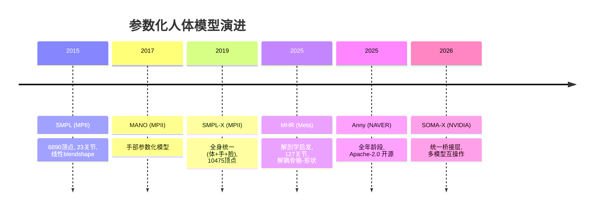

# 参数化人体模型综述

## 概述

参数化人体模型（Parametric Human Body Model）是 3D 计算机视觉与计算机图形学的核心基础设施。它将人体形状与姿态编码为低维参数空间，使得从图像/视频中恢复 3D 人体、驱动虚拟角色、生成训练数据等任务成为可能。

本综述覆盖以下主流模型，从数学原理、设计哲学、优劣势三个维度进行系统整理与对比。

---

## 一、模型演进时间线



---

## 二、各模型数学原理详解

### 2.1 SMPL — 蒙皮多人线性模型 (2015)

> 详见 [[02_L2_核心技术与算法 (Core Tech & Algorithms)/2026-05-12-SMPL-蒙皮多人线性模型.md|SMPL 笔记]]

**核心思想**：所有变形均为线性操作，简单高效。

**模型函数**：

$$M(\beta, \theta) = W\Big( T(\beta, \theta),\; J(\beta),\; \theta,\; \mathcal{W} \Big)$$

**三阶段流程**：

| 阶段 | 公式 | 含义 |
|------|------|------|
| ① 模板变形 | $T(\beta, \theta) = \bar{T} + B_S(\beta) + B_P(\theta)$ | 形状 + 姿态校正 |
| ② 关节回归 | $J(\beta) = \mathcal{J} \cdot (\bar{T} + B_S(\beta))$ | **从顶点回归关节位置** |
| ③ LBS蒙皮 | $v'_i = \sum w_{k,i} G'_k(\theta,J) v_i$ | 线性混合蒙皮 |

**形状空间**：$B_S(\beta) = \sum_{n=1}^{10} \beta_n S_n$ — 10 维 PCA，从 3D 扫描学习。

**姿态校正**：$B_P(\theta) = \sum_{n=1}^{9K} (R(\theta)-R(\theta^*))_n P_n$ — 旋转矩阵元素的线性函数，通过 Rodrigues 公式从轴角映射。

| 维度 | 值 |
|------|-----|
| 顶点数 | 6,890 |
| 关节数 | 23（从网格回归） |
| 姿态参数 $\theta$ | 72（24 关节 × 3 轴角） |
| 形状参数 $\beta$ | 10（PCA） |
| **总参数量** | **82** |

**关键局限**：
- 骨骼与形状**耦合**：$J(\beta)$ 依赖 $\beta$，无法独立调整骨骼长度
- 无手部关节、无面部表情
- 姿态校正是线性函数，表达能力受限
- 许可证受限，需注册获取

---

### 2.2 SMPL-X — 全身表现力模型 (2019)

> 详见 [[02_L2_核心技术与算法 (Core Tech & Algorithms)/2026-05-12-SMPL-蒙皮多人线性模型.md|SMPL 笔记]]（SMPL 笔记中涵盖 SMPL-X）

**核心思想**：SMPL 的全身扩展，数学框架**完全不变**，仅扩展维度并增加表情和手部。

**模型函数**：

$$M(\beta, \theta, \psi) = W\Big( T_p(\beta, \theta, \psi),\; J(\beta),\; \theta,\; \mathcal{W} \Big)$$

**模板变形**：$T_p(\beta, \theta, \psi) = \bar{T} + B_S(\beta) + B_E(\psi) + B_P(\theta)$

- $B_E(\psi) = \sum_{i=1}^{10} \psi_i E_i$ — **新增表情 blendshape**，10 维 PCA（来自 FLAME）
- $\theta_h = \mathcal{M} \cdot m_h$ — 手部姿态通过 **MANO PCA 子空间** 压缩为 24 维（每手 12 维）

> 手部模型参见 [[02_L2_核心技术与算法 (Core Tech & Algorithms)/2026-05-11-MANO-手部参数化模型.md|MANO 笔记]]

| 维度 | SMPL | SMPL-X |
|------|------|--------|
| 顶点数 | 6,890 | 10,475 |
| 关节数 | 23 | 54（含手指、下颚、眼球） |
| 姿态参数 | 72（轴角） | 75（身体） + 24（手部PCA） |
| 形状参数 | 10 | 10 |
| 表情参数 | ❌ | 10（PCA） |
| **总参数量** | **82** | **119** |

**与 SMPL 的相同约束**：
- 骨骼-形状仍耦合：$J(\beta) = \mathcal{J}(\bar{T} + B_S(\beta))$
- 姿态校正仍是线性
- 许可证仍受限

---

### 2.3 MHR — 解剖学启发模型 (2025)

> 详见 [[02_L2_核心技术与算法 (Core Tech & Algorithms)/2026-05-12-MHR-Momentum-Human-Rig-参数化人体模型.md|MHR 笔记]]

**核心思想**：与 SMPL 系**推倒重来**——骨骼与表面解耦、非线性姿态校正、语义化表情。

**模型函数**：

$$X(\beta, \theta) = M\Big( \tilde{X}(\beta^s, \beta^f, \theta),\; B^k(\beta^k),\; \theta,\; \omega \Big)$$

**① 三子空间身份模型**：

$$\beta^s = \{ \beta^{sb}, \beta^{ss}, \beta^{sh} \}$$

| 子空间 | 维度 | 含义 |
|--------|------|------|
| 身体形状 $\beta^{sb}$ | 20 | 全身比例、体型 |
| 头骨形状 $\beta^{ss}$ | 20 | 头部/颅骨形态 |
| 手部形状 $\beta^{sh}$ | 5 | 手部形态 |

三者独立，可单独调节，互不干扰。

**② 语义化面部表情**（非 PCA）：

$$B^f(\beta^f, F) = \sum_{n=1}^{72} \beta^f_n \cdot F_n$$

基于 **Ekman FACS 编码系统**，每个 $\beta^f_n$ 对应一个语义动作单元（如"抬眉""撇嘴"），**可解释性强**。

SMPL-X 的 10 维 PCA 表情 → 数学上紧凑但无语义；MHR 的 72 维 FACS → 有语义但维度更高。

**③ 显式运动学骨架**（非回归）：

127 个关节，每关节 7 DOF（位移 × 旋转 × 缩放）：

$$T_w = T_p \times T_{off} \times T_t \times T_{prerot} \times T_{rot} \times T_s$$

**204 个姿态参数** = 136 姿态参数 + 68 骨骼变换参数。

**与 SMPL 的关键区别**：SMPL 的关节 $J(\beta)$ 是从顶点**回归**的（因此受形状影响），MHR 的关节是显式定义的**独立运动链**（骨骼长度可独立操控，与形状解耦）。

**④ 非线性姿态校正（核心创新）**：

对比 SMPL 的线性校正与 MHR 的 MLP 校正：

| | SMPL | MHR |
|--|------|-----|
| 输入 | 旋转矩阵元素 $R(\theta)$ | 6D 连续旋转偏差 $R_{6d}(\theta) - R_{6d}(0)$ |
| 函数形式 | 线性：$\sum (R-R^*)_n P_n$ | **非线性**：$\text{MLP}( \cdot )$ |
| 感受野 | 全局（所有关节） | **局部**（关节 + 父/子邻居） |
| 稀疏性 | 无 | 可学习激活掩码 $\phi(A_j)$ |

具体数学表达：

$$\text{Non-Linear}_j(\theta) = \text{MLP}\big( \{ R_{6d}(\theta_a) - R_{6d}(\vec{0}) \;|\; a \in n(j) \} \big)$$

$$B^p_j = \underbrace{\phi(A_j)}_{\text{稀疏掩码}} \odot \big( \underbrace{P_j}_{\text{校正矩阵}} \times \text{Non-Linear}_j(\theta) \big)$$

**⑤ 艺术家定义的蒙皮权重**（非学习）：

SMPL 的 $\mathcal{W}$ 从数据学习，MHR 的 $\omega$ 由艺术家手动绑定。每条顶点受 4-8 关节影响（SMPL 最多 4）。

**⑥ 7 级 LOD（细节层次）**：

从 73,639 到 595 顶点，低 LOD 通过最邻近三角面重心坐标映射。

| 维度 | MHR |
|------|-----|
| 顶点数 | 73,639 / 18,439 / 10,661 / 4,899 / 2,461 / 971 / 595 |
| 关节数 | 127（显式运动学链） |
| 姿态参数 | 204 |
| 身份参数 | 45（身体20 + 头骨20 + 手部5） |
| 表情参数 | 72（FACS 语义） |
| **总参数量** | **321** |

**已用于**：[[02_L2_核心技术与算法 (Core Tech & Algorithms)/2026-05-12-SAM-3D-Body-单图全身3D网格恢复.md|SAM 3D Body]] 的基础网格表示。

---

### 2.4 Anny — 全年龄段可微分模型 (2025)

> 详见 [[02_L2_核心技术与算法 (Core Tech & Algorithms)/2026-05-12-Anny-全年龄段可微分人体模型.md|Anny 笔记]]

**核心思想**：不做另一个"成人扫描模型"，而是覆盖全年龄段，基于人体测量数据而非 3D 扫描。

**数学特点**：

- **形状空间**：分段多线性插值（Piecewise Multi-linear Interpolation），在原型 blendshape 之间插值
- **表型参数**（Phenotype Parameters）：年龄、性别、身高、体重等，取值 $[0,1]$ 区间，**语义可解释**
- **统计校准**：基于 WHO 人口统计数据的 Beta 分布
- **无扫描偏差**：不依赖 3D 扫描，避免 SMPL/MHR 的成人扫描分布偏差

| 维度 | Anny |
|------|------|
| 基础顶点数 | 13,380（四边形面，13,378 面） |
| 骨骼数 | 163 |
| 姿态表示 | 3D 旋转（关节空间） |
| 形状表示 | 语义表型参数（分段多线性插值） |
| 许可证 | Apache-2.0 ✅ |
| 安装 | `pip install anny[warp,examples]` |

**适用场景**：儿童建模、老龄化研究、需要可解释形状控制的场景。

---

## 三、模型架构对比总表

### 3.1 数学框架对比

| 维度 | SMPL (2015) | SMPL-X (2019) | MHR (2025) | Anny (2025) |
|------|-------------|---------------|-------------|-------------|
| **形状-骨骼关系** | 耦合：$J = \mathcal{J}(\bar{T}+B_S)$ | 同左 | **解耦**：骨骼独立于形状 | 解耦 |
| **姿态校正** | 线性：$\sum(R-R^*)_n P_n$ | 同左（线性） | **MLP 非线性** + 稀疏激活 | N/A（侧重形状而非姿态校正） |
| **表情建模** | ❌ 无 | 10维 PCA | **72维 FACS 语义** | 有限 |
| **形状空间** | 10维 PCA（全局） | 10维 PCA（全局） | **45维（3独立子空间）** | 语义表型参数 |
| **关节定义** | 从顶点回归（23） | 从顶点回归（54） | **显式运动学链（127）** | 显式运动学链（163） |
| **蒙皮权重** | 数据学习 | 数据学习 | **艺术家手动绑定** | 艺术家绑定 |
| **LOD** | 无 | 无 | **7 级** | 无 |
| **数据来源** | 3D 扫描（成人） | 3D 扫描（成人） | 3D 扫描（成人） | **人体测量数据（全年龄）** |
| **许可证** | 受限 | 受限 | Apache-2.0 | Apache-2.0 |

### 3.2 参数规模对比

```
参数分布对比（数字 = 维度数）：

SMPL:     [姿态 72] [形状 10]                                 =  82
SMPL-X:   [姿态 99] [形状 10] [表情 10]                        = 119
MHR:      [姿态 204] [身体形状 20] [头骨 20] [手部 5] [FACS表情 72]  = 321
Anny:     [姿态 可变] [表型参数 连续]                            = 取决于具体实现
```

### 3.3 优劣势矩阵

| 模型 | 优势 | 劣势 |
|------|------|------|
| **SMPL** | ✅ 生态最大，数据集/论文/工具几乎都以它为基准<br>✅ 参数少（82维），优化稳定<br>✅ CV 社区事实标准 | ❌ 骨骼-形状耦合，无法独立调骨骼<br>❌ 线性姿态校正表达能力有限<br>❌ 无手/脸/表情<br>❌ 许可证受限 |
| **SMPL-X** | ✅ 全身统一（体+手+脸）<br>✅ 与 SMPL 生态兼容<br>✅ CV 领域使用最广的全身模型 | ❌ 继承 SMPL 所有架构缺陷（耦合、线性校正）<br>❌ 对表情密集图像容易过拟合<br>❌ 手部 PCA 降维损失细节<br>❌ 许可证受限 |
| **MHR** | ✅ 骨骼-形状完全解耦，艺术家友好<br>✅ 非线性 MLP 校正，更真实<br>✅ 72 语义表情可解释性强<br>✅ 7 级 LOD 灵活适配多种设备<br>✅ Apache-2.0 开源 | ❌ 参数量大（321），优化更复杂<br>❌ 生态远不如 SMPL<br>❌ 训练需要更多数据<br>❌ 目前仅 Meta 内部项目使用 |
| **Anny** | ✅ 全年龄段覆盖（唯一选择）<br>✅ 语义化表型参数可解释<br>✅ 基于 WHO 统计，无扫描偏见<br>✅ Apache-2.0 开源 | ❌ 缺乏工业级生态支持<br>❌ 姿态校正能力弱于 MHR<br>❌ 目前主要用于数据生成而非重建 |

---

## 四、为什么会出现这么多模型？

### 4.1 本质原因：建模目标的分歧

每种模型的设计决策本质上是以下三个维度的取舍：

```
表达能力 ↑
    |    MHR (321维, MLP, 127关节)
    |        |
    |    SMPL-X (119维, 线性, 54关节)
    |    SMPL (82维, 线性, 23关节)
    |        |
    |    Anny (语义参数, 全年龄覆盖)
    +--------------------------------→ 通用性/易用性
```

### 4.2 三个核心矛盾

**① 线性 vs 非线性**
- SMPL 选线性：简单、稳定、可微、低数据量需求
- MHR 选 MLP 非线性：更真实，但需要更多数据和计算
- 这是**效率-保真度**的经典权衡

**② 耦合 vs 解耦**
- SMPL 选耦合：$J(\beta)$ 绑定形状，实现简单
- MHR 选解耦：骨骼独立于形状，CG 管线必须解耦
- 这是**CV（端到端学习）vs CG（艺术家操控）** 的根本分歧

**③ 扫描驱动 vs 测量驱动**
- SMPL/MHR 基于 3D 扫描 → 受限于扫描人群分布（成人体型偏瘦）
- Anny 基于人体测量数据 → 覆盖全年龄，但缺乏真实扫描的细节

---

## 五、SOMA-X — 统一桥接层 (2026)

> 详见 [[02_L2_核心技术与算法 (Core Tech & Algorithms)/2026-05-12-SOMA-X-统一参数化人体模型.md|SOMA-X 笔记]]

### 核心思路

不做另一个人体模型，而是做**模型的模型**——一个统一的中间表示，解决 $O(M^2)$ 的互操作问题。

### 架构

```
              ┌─────────────┐
              │  SOMA-X     │
              │  规范拓扑    │
              │  规范骨架    │
              └──────┬──────┘
         ┌───────────┼───────────┐
         ▼           ▼           ▼
      SMPL-X       MHR         Anny
     (MPII)      (Meta)      (NAVER)
```

- **规范网格拓扑**：每个顶点恒定时间将源模型映射到共享规范网格
- **规范骨架抽象**：无需迭代优化即可恢复适配身份的关节变换
- **统一动画管线**：一套姿态参数驱动所有模型
- **双向转换**：SMPL ↔ SOMA、MHR ↔ SOMA

### 性能

| 指标 | 值 |
|------|-----|
| 转换速度 | 17,393 FPS (A100) |
| 平均误差 | 0.53 cm (AMASS → SOMA) |
| 安装 | `pip install py-soma-x` |

### 意义

SOMA-X 标志着行业认知的转变——**不再追求"一个模型统治一切"，而是承认多模型并存，通过抽象层实现互通**。这与深度学习框架的 ONNX/TorchDynamo 思路一脉相承。

---

## 六、应用生态一览

以下笔记覆盖了基于上述参数化模型的 3D 人体重建方法：

| 方法 | 基于模型 | 核心能力 |
|------|---------|----------|
| [[02_L2_核心技术与算法 (Core Tech & Algorithms)/2026-05-12-SAM-3D-Body-单图全身3D网格恢复.md|SAM 3D Body]] | **MHR** | 单图全身网格恢复，Meta 出品 |
| [[02_L2_核心技术与算法 (Core Tech & Algorithms)/2026-05-11-PromptHMR-Promptable人类网格恢复.md|PromptHMR]] | SMPL-X | 可提示人体网格恢复，CVPR 2025 |
| [[02_L2_核心技术与算法 (Core Tech & Algorithms)/2026-05-11-WHAM-世界坐标系人体运动重建.md|WHAM]] | SMPL | 世界坐标系人体运动恢复，CVPR 2024 |
| [[02_L2_核心技术与算法 (Core Tech & Algorithms)/2026-05-11-TRAM-全局3D人体轨迹与运动重建.md|TRAM]] | SMPL | 全局轨迹 + SLAM |
| [[02_L2_核心技术与算法 (Core Tech & Algorithms)/2026-05-11-GVHMR-重力视角人体运动恢复.md|GVHMR]] | SMPL (via WHAM) | 重力对齐世界坐标，SIGGRAPH Asia 2024 |
| [[02_L2_核心技术与算法 (Core Tech & Algorithms)/2026-05-11-HaMeR-3D手部重建.md|HaMeR]] | MANO | 单图手部重建，CVPR 2024 |

另有：
- [[02_L2_核心技术与算法 (Core Tech & Algorithms)/2026-05-12-GarmentMeasurements-服装测量生成.md|GarmentMeasurements]] — 与人体模型配合的服装测量
- [[02_L2_核心技术与算法 (Core Tech & Algorithms)/2026-05-11-Sapiens2-高分辨率人体视觉Transformer.md|Sapiens2]] — 人体视觉 Transformer，作为人体理解骨干网络

---

## 七、未来趋势判断

### 短期（1-2 年）：SMPL-X 仍占主导
- 现有数据集、benchmark、论文惯性极大
- 新方法仍以 SMPL 系为主

### 中期（2-4 年）：MHR 在工业界崛起，Anny 在特定场景补位
- MHR 的骨骼-形状解耦在 AR/VR、游戏、影视是刚需
- Meta 有足够资源推动 MHR 生态（PyTorch + SAM + MHR）
- Anny 在儿童/老年人建模中不可替代

### 远期（4-6 年）：多模型 + 桥接层成常态
- **SOMA-X 式的统一抽象层是终局方向**
- 不同场景用不同模型，所有管线对接 SOMA 拓扑
- 类似深度学习框架的演化路径：群雄割据 → ONNX 桥接 → 标准化

### 核心结论

> **MHR 最有希望成为"下一代事实标准"，但不会完全取代 SMPL——SOMA-X 类的桥接层才是真正的赢家。**

最终格局：**MHR 做工业级核心表示 → Anny 补全人群覆盖 → SOMA-X 做互操作底座 → SMPL 作为 legacy 长期存在**。

---

## 八、相关笔记索引

### 核心模型笔记
- [[02_L2_核心技术与算法 (Core Tech & Algorithms)/2026-05-12-SMPL-蒙皮多人线性模型.md|SMPL — 蒙皮多人线性模型]]
- [[02_L2_核心技术与算法 (Core Tech & Algorithms)/2026-05-12-MHR-Momentum-Human-Rig-参数化人体模型.md|MHR — 解剖学启发参数化人体模型]]
- [[02_L2_核心技术与算法 (Core Tech & Algorithms)/2026-05-12-Anny-全年龄段可微分人体模型.md|Anny — 全年龄段可微分人体模型]]
- [[02_L2_核心技术与算法 (Core Tech & Algorithms)/2026-05-12-SOMA-X-统一参数化人体模型.md|SOMA-X — 统一参数化人体模型中间表示]]
- [[02_L2_核心技术与算法 (Core Tech & Algorithms)/2026-05-11-MANO-手部参数化模型.md|MANO — 手部参数化模型]]

### 应用方法笔记
- [[02_L2_核心技术与算法 (Core Tech & Algorithms)/2026-05-12-SAM-3D-Body-单图全身3D网格恢复.md|SAM 3D Body — 单图全身 3D 网格恢复]]
- [[02_L2_核心技术与算法 (Core Tech & Algorithms)/2026-05-11-PromptHMR-Promptable人类网格恢复.md|PromptHMR — 可提示人体网格恢复]]
- [[02_L2_核心技术与算法 (Core Tech & Algorithms)/2026-05-11-WHAM-世界坐标系人体运动重建.md|WHAM — 世界坐标系人体运动重建]]
- [[02_L2_核心技术与算法 (Core Tech & Algorithms)/2026-05-11-TRAM-全局3D人体轨迹与运动重建.md|TRAM — 全局 3D 人体轨迹与运动重建]]
- [[02_L2_核心技术与算法 (Core Tech & Algorithms)/2026-05-11-GVHMR-重力视角人体运动恢复.md|GVHMR — 重力视角人体运动恢复]]
- [[02_L2_核心技术与算法 (Core Tech & Algorithms)/2026-05-11-HaMeR-3D手部重建.md|HaMeR — 3D 手部重建]]

### 相关基础设施
- [[02_L2_核心技术与算法 (Core Tech & Algorithms)/2026-05-11-Sapiens2-高分辨率人体视觉Transformer.md|Sapiens2 — 高分辨率人体视觉 Transformer]]
- [[02_L2_核心技术与算法 (Core Tech & Algorithms)/2026-05-12-GarmentMeasurements-服装测量生成.md|GarmentMeasurements — 3D 服装测量生成]]

---

## 九、参考文献

1. Loper et al. "SMPL: A Skinned Multi-Person Linear Model." SIGGRAPH Asia 2015. [https://smpl.is.tue.mpg.de/](https://smpl.is.tue.mpg.de/)
2. Pavlakos et al. "Expressive Body Capture: 3D Hands, Face, and Body from a Single Image." CVPR 2019. [https://smpl-x.is.tue.mpg.de/](https://smpl-x.is.tue.mpg.de/)
3. MHR: Momentum Human Rig. arXiv 2511.15586. Meta 2025. [https://github.com/facebookresearch/MHR](https://github.com/facebookresearch/MHR)
4. Brégier et al. "Anny: All-Ages Differentiable Human Model." arXiv 2511.03589. NAVER 2025. [https://github.com/naver/anny](https://github.com/naver/anny)
5. SOMA-X: Unified Parametric Human Model Intermediary Representation. NVIDIA Labs 2026. [https://github.com/NVlabs/SOMA-X](https://github.com/NVlabs/SOMA-X)
