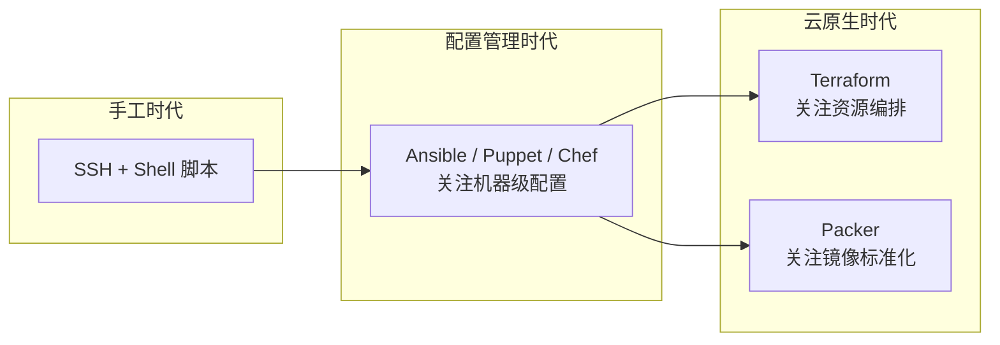

# IaC（基础设施即代码）工具链

> Infrastructure as Code 工具生态对比：Terraform（资源编排）、Packer（机器镜像）、Ansible（配置管理）。注：Docker 在此体系中负责**容器镜像**层，与 Packer 的**机器镜像**层处于不同抽象级别。

## 覆盖范围

- 三大工具的定位分工与互补关系，以及 Docker 在其中的位置
- 各工具的适用边界与常见组合模式
- 在 AI Infra（GPU 集群、实验环境、部署管道）中的落地场景

## 发展脉络

IaC 经历了三个阶段的工具分化：



- **第一阶段**：SSH 到机器上手动执行命令，或写 Shell/Python 脚本批量执行
- **第二阶段**：Ansible 等配置管理工具将机器配置代码化、幂等化
- **第三阶段**：云原生时代，基础设施粒度从"机器"上升到"API 资源"，Terraform 管理云资源声明周期，Packer 构建不可变镜像

## 核心对比

### 定位差异

| 维度 | Terraform | Packer | Ansible |
|------|-----------|--------|---------|
| **定位** | 基础设施编排 | 不可变机器镜像构建（VM 级） | 配置管理与应用部署 |
| **工作方式** | 声明式（HCL），描述期望状态 | 声明式（HCL），定义镜像模板 | 过程式（YAML），编排执行步骤 |
| **状态管理** | 有状态（`terraform.tfstate`） | 无状态，每次构建独立 | 无状态，幂等执行 |
| **执行对象** | 云平台 API（AWS/GCP/Azure） | 镜像构建器（VirtualBox/VMware/QEMU/CloudStack） | SSH 连接远程节点 |
| **结果产物** | 云资源（VPC/VM/DB 等） | **VM 镜像**（AMI/VMDK/QCOW2/ISO） | 机器状态变更 |
| **与 Docker 的关系** | 可编排容器基础设施（EKS/GKE） | 部分 builder 支持 Docker 输出，但 Docker 不是其主要目标；容器镜像应用 `docker build` | 可对接 Docker 守护进程管理容器 |

### 协作模式

三者不是替代关系，而是**互补串联**。Docker 在抽象级别上区别于 Packer 的机器镜像，两者在不同场景下分工明确：

```
┌─ VM 级基础设施（Packer 领地）──────────────────────────────────────┐
│                                                                    │
│  Packer                   Terraform                  Ansible       │
│  构建黄金机器镜像 ──────→ 基于镜像创建 VM ──────→ 配置 VM + 部署软件 │
│  （AMI/VMDK/QCOW2）      （VPC/子网/实例）         （驱动/agent/监控）│
│                                                                    │
└────────────────────────────────────────────────────────────────────┘

┌─ 容器级基础设施（Docker 领地）──────────────────────────────────────┐
│                                                                    │
│  Docker Build              Terraform + K8s          Ansible         │
│  构建容器镜像 ──────────→ 编排容器运行时 ────────→ 配置节点/集群    │
│  （OCI Image）             （Pod/Service/Volume）    （kubelet/Docker）│
│                                                                    │
└────────────────────────────────────────────────────────────────────┘
```

**两条流水线可以混合**：Packer 构建的 VM 内部可以运行 Docker 容器，这就是 AI Infra 中最常见的混合模式。

**典型流水线（AI Infra 混合模式）：**

1. **Packer** 构建预装 NVIDIA 驱动 + Docker + NVIDIA Container Toolkit 的 GPU AMI
2. **Terraform** 声明式创建 VPC、安全组，并用该 AMI 启动 GPU 实例（如 AWS `p4d`/`p5`）
3. 实例启动后，**Docker** 在 VM 内运行容器化的 PyTorch 训练任务
4. **Ansible**（可选）在 VM 启动后做最终配置注入、挂载 EFS 存储等

### 各工具细节

#### Terraform — 资源编排

- **核心价值**：将云基础设施（计算、网络、存储、IAM）声明为代码，可视化 diff，版本化变更历史
- **有状态**：`tfstate` 记录实际资源状态，`plan` 预览变更，`apply` 执行变更
- **Provider 生态**：AWS、GCP、Azure、Kubernetes、Cloudflare 等数千个 provider
- **AI Infra 场景**：编排 GPU 集群（AWS `p4d`/`p5` 实例）、创建 EFS/NFS 共享存储、配置安全组和网络隔离

#### Packer — 不可变机器镜像

- **核心价值**：自动化构建预配置的标准**机器镜像**（VM 级），避免"启动后手工配置"的漂移
- **不可变基础设施**：每次部署使用新镜像启动新实例，旧实例直接销毁
- **多构建器**：同一 HCL 定义可同时构建 AMI（AWS）、VMDK（VMware）、QCOW2（QEMU）、ISO 等多种格式
- **AI Infra 场景**：构建预装 NVIDIA 驱动 + NVIDIA Container Toolkit 的 GPU AMI，确保实例启动后即可运行 GPU Docker 容器

> **与 Docker 的关键区别**：Packer 产出的是**机器镜像**（包含内核、驱动、init 系统），可在裸机或虚拟机监控器上直接启动；而 Docker 产出的是**容器镜像**（共享宿主机内核，仅包含用户态程序和依赖）。Packer 的 "docker" builder 实际上是**用 Docker 容器作为构建环境来生成 artifact**（如 AMI），而不是用来构建容器镜像本身。构建容器镜像用 `docker build` 即可，不需要 Packer。
>
> **CUDA 的分层归属**：NVIDIA 驱动（内核模块）属于 VM/宿主机层，由 Packer 预装；CUDA Toolkit、cuDNN、PyTorch 属于容器层，写在 Dockerfile 中。NVIDIA Container Toolkit 负责将宿主机驱动暴露给容器。

| 维度 | Packer（机器镜像） | Docker（容器镜像） |
|------|-------------------|-------------------|
| 抽象级别 | 硬件/虚拟化层（包含 OS 内核） | 操作系统层（共享宿主机内核） |
| 典型产物 | AMI、VMDK、QCOW2、ISO | OCI Image（Docker image） |
| 启动方式 | 启动 VM / 物理机 | `docker run` / 容器运行时 |
| 构建速度 | 慢（需要初始化完整 OS） | 快（层缓存 + 共享内核） |
| 可移植性 | 依赖特定虚拟化平台 | OCI 标准，跨平台 |
| AI Infra 中的角色 | 预装 NVIDIA 驱动 + Container Toolkit | 包含 CUDA runtime + cuDNN + PyTorch |

#### Packer vs Ansible — 两大配置哲学的边界

| 维度 | Packer（不可变镜像） | Ansible（可变配置） |
|------|--------------------|--------------------|
| **操作时机** | 构建镜像时（离线，一次性） | 实例运行后（在线，持续） |
| **变更策略** | 每次改镜像 → 销毁旧实例 → 新实例替换 | 在运行中的实例上修正配置 |
| **执行频率** | 每次代码变更构建一次 | 可反复/定时执行（幂等） |
| **状态管理** | 无状态，每次从零构建 | 有漂移检测，修正到期望状态 |
| **处理速度** | 慢（完整 OS 初始化） | 快（只改差异部分） |
| **版本管理** | 镜像 tag 化，回滚即切 tag | Git 回退 playbook 后重新 apply |
| **失败影响** | 构建失败无影响，不产生 artifact | 执行中途失败可能导致部分应用 |

**选择指南：**

- **适合 Packer**：标准化黄金镜像、需要快速扩缩容的场景、安全合规要求"无漂移"的环境
- **适合 Ansible**：已有运行中的机器需要持续维护、配置频繁变化、需要按需修正
- **混合使用**：Packer 预装"慢变层"（OS、驱动、Docker、监控 agent），Ansible 管理"快变层"（应用配置、密钥注入、服务开关）— 这也是最推荐的模式，详见 [[2026-05-19-ansible-自动化运维平台#快变层管理实战|Ansible 快变层管理实战]]

实际工程中，env-factory 的 `stacks/devops` 栈集成了两者的工具链：
- `stacks/devops/Dockerfile` 作为 DevOps 环境容器，内部安装 Terraform、Packer、Ansible 等工具
- 开发者用这个容器环境去构建 AMI（Packer）或管理服务器（Ansible）

#### Ansible — 配置管理

- 见 [[2026-05-19-ansible-自动化运维平台|Ansible 自动化运维平台]] 详细笔记
- **AI Infra 场景深化**：批量安装 NVIDIA 驱动、配置 Docker/NVIDIA Container Toolkit、管理实验集群用户和权限、滚动更新分布式训练环境

## 非云端环境的构建策略

端侧设备、开发者本地机器、边缘盒子等非云端场景下，Packer 和 Ansible 的分工与云端不同：

| 场景 | 初始构建 | 持续升级 | 推荐工具 |
|------|---------|---------|---------|
| **开发机 macOS** | — | Ansible 管理 Homebrew 包、dotfiles、工具链版本 | Ansible（无 VM 层，无 Packer 用武之地） |
| **开发机 Linux** | Packer 构建 Vagrant box 或 VM 模板 | Ansible Provisioner 做首次配置；后续用 Ansible pull 模式更新 | Packer（初始） + Ansible（持续） |
| **Docker 开发环境** | 见 [[容器化管理实验环境最佳实践]] | 修改 Dockerfile 后重建 | `docker build` / DevContainer |
| **端侧设备（树莓派/Jetson）** | Packer/QEMU 构建 SD 卡镜像（含系统 + 基础软件） | Ansible 通过 SSH 做 OTA 后的配置更新、应用部署 | Packer（初始刷机镜像） + Ansible（持续运维） |
| **边缘盒子（x86 工控机）** | Packer 构建 PXE 网络启动镜像或 ISO | Ansible 做配置漂移检测、日志采集、安全补丁 | Packer（基线镜像） + Ansible（持续） |
| **混合：本地开发 + 云端部署** | Ansible 配置本地开发机，Packer + Terraform 构建云端环境 | 同上 | 见上文协作模式 |

**关键判断**：是否需要"从零复现"？需要则 Packer；只需"修正现有机器"则 Ansible。非云端场景中两者往往串联使用，不存在非此即彼的选择。

## AI Infra 中的选择建议

| 场景 | 推荐工具 | 理由 |
|------|----------|------|
| 从零搭建云端 GPU 集群 | Terraform + Ansible | TF 创建云资源，Ansible 配置环境 |
| 团队共享 VM 开发环境（AMI） | Packer | 构建预装 NVIDIA 驱动 + Container Toolkit 的机器镜像 |
| 团队共享容器化开发环境 | Dockerfile / DevContainer | `docker build` 构建含 CUDA + PyTorch 的 OCI 镜像 |
| 管理现有服务器的软件配置 | Ansible | 无需预装 agent，已有 SSH 即可 |
| 容器化实验环境 | Docker / DevContainer | 见 [[容器化管理实验环境最佳实践]] |
| 混合：云端 GPU + 本地存储 | Terraform + Ansible | TF 管理云资源，Ansible 挂载存储 |
| **开发机环境搭建（macOS）** | **Ansible** | 管理 Homebrew 包、dotfiles、工具链，无 VM 层介入 |
| **端侧设备刷机 + 持续更新** | **Packer + Ansible** | Packer 构建初始镜像，Ansible 做 OTA 后配置更新 |
| **本地 Linux 开发机** | **Ansible（或 Packer box）** | 已有机器用 Ansible；需要可复现基线则 Packer 构建 Vagrant box |

## 关联笔记

- [[2026-05-19-ansible-自动化运维平台|Ansible 自动化运维平台]]
- [[容器化管理实验环境最佳实践]] — 容器化 vs 机器级配置管理，互补关系
- [[2026-05-19-分层决策-PackerAnsibleTerraformDocker的分工与边界|分层决策：Packer/Ansible/Terraform/Docker 分工与边界]] — 三维决策框架 + 六个重叠区域的详细对比
- 实际工程参考：env-factory 的 `stacks/devops` 栈集成了 Docker、kubectl、Helm、Terraform、Packer、Ansible、Vault、AWS CLI — 详见 [[容器化管理实验环境最佳实践#6.1 实战参考：env-factory 三层架构]]
