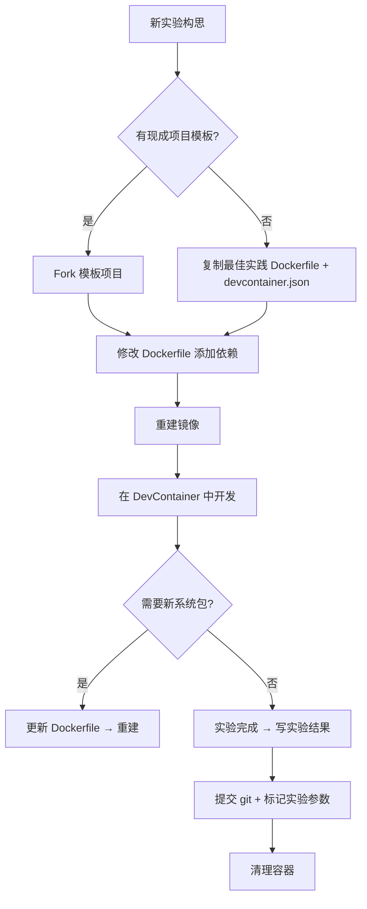

# 容器化管理实验环境最佳实践

> 从 Dockerfile 出发，系统调研如何用容器技术管理 ML/AI 实验环境，兼顾**可复现性**、**开发体验**和**团队协作**。

---

## 1. 为什么需要容器化实验环境

### 1.1 核心痛点

| 问题 | 表现 |
|------|------|
| "It works on my machine" | 环境差异导致结果不可复现 |
| CUDA 版本冲突 | 不同项目依赖 CUDA 11.x / 12.x，难以共存 |
| Python 依赖地狱 | pip 依赖树冲突，conda 环境膨胀 |
| 团队 onboarding 慢 | 新成员花半天配置环境 |
| 论文复现困难 | 缺少精确的环境记录 |

### 1.2 容器化的价值

- **可复现性**：锁死操作系统、CUDA、Python、所有 pip 包的精确版本
- **隔离性**：每个实验独立容器，互不干扰
- **可移植性**：一份 Dockerfile/DevContainer 配置，团队共享
- **可废弃性**：实验结束直接删容器，不留残留

---

## 2. Dockerfile 最佳实践

### 2.1 版本锁定：永远不要用 `latest`

```dockerfile
# ❌ 坏实践：不可预测
FROM nvidia/cuda:latest

# ✅ 好实践：精确锁定
FROM nvidia/cuda:12.4.0-runtime-ubuntu22.04
# FROM nvidia/cuda:12.4.0-devel-ubuntu22.04  # 如果需编译 CUDA 代码
```

- CUDA 镜像中 `runtime` 不含编译器（~1.5GB），`devel` 含编译器（~3.5GB）
- 开发阶段用 `devel`，实验运行时用 `runtime`
- 宿主机的 NVIDIA 驱动版本 **必须 ≥ 容器内 CUDA 版本**

### 2.2 多阶段构建 (Multi-Stage Builds)

分离"编译阶段"和"运行阶段"，减少最终镜像体积 40-60%。

```dockerfile
# Stage 1: Builder — 安装编译依赖
FROM nvidia/cuda:12.4.0-devel-ubuntu22.04 AS builder
RUN apt-get update && apt-get install -y --no-install-recommends \
    build-essential cmake && \
    rm -rf /var/lib/apt/lists/*
WORKDIR /build
COPY requirements-build.txt .
RUN pip install --user -r requirements-build.txt

# Stage 2: Runtime — 最小运行环境
FROM nvidia/cuda:12.4.0-runtime-ubuntu22.04
RUN apt-get update && apt-get install -y --no-install-recommends \
    python3.11 python3-pip && \
    rm -rf /var/lib/apt/lists/*

# 只复制需要的 artifacts
COPY --from=builder /root/.local /root/.local
COPY --from=builder /build/wheels/ /opt/wheels/

WORKDIR /workspace
COPY requirements-run.txt .
RUN pip install --no-cache-dir -r requirements-run.txt
COPY src/ ./src/
```

### 2.3 层序优化：按变更频率排列

Docker 镜像的每一层都会缓存，**把不常变的东西放前面**：

```dockerfile
# 1️⃣ 系统依赖（几乎不变）
RUN apt-get update && apt-get install -y --no-install-recommends \
    python3.11 python3.11-venv git curl && \
    rm -rf /var/lib/apt/lists/*

# 2️⃣ Python 依赖（偶尔变动）
COPY requirements.txt .
RUN --mount=type=cache,target=/root/.cache/pip \
    pip install -r requirements.txt

# 3️⃣ 代码（每次改）
COPY . .
```

> `--mount=type=cache` 利用 BuildKit 缓存 pip 下载，二次构建可省 5-10 分钟。

### 2.4 分离训练/推理依赖

训练和服务所需的包截然不同，使用两个 requirements 文件：

```txt
# requirements-train.txt (训练容器)
torch==2.4.0
torchvision==0.19.0
mlflow==2.15.0
optuna==4.0.0
dvc[s3]==3.52.0
matplotlib==3.9.0
wandb==0.17.0

# requirements-serve.txt (推理容器)
torch==2.4.0
torchvision==0.19.0
fastapi==0.111.0
uvicorn==0.30.0
pydantic==2.7.0
```

### 2.5 安全与用户

```dockerfile
# 不要以 root 运行
RUN useradd -m -s /bin/bash researcher
USER researcher
WORKDIR /home/researcher/workspace
```

---

## 3. 关键研究：apt-get update 的非确定性

> 参考：ACM Euro-Par 2024 的 Dockerfile 追踪研究（2025 年发表）

研究发现：即使基础镜像 tag 锁定了，`RUN apt-get update` 也会从 Ubuntu 仓库拉取**当前最新**的包，导致环境随月变化。同一个 Dockerfile 在不同月份构建，得到的 libc、openssl 等系统库版本不同。

**改进方案**（按可靠性排序）：

| 方案 | 可靠性 | 复杂度 |
|------|--------|--------|
| 锁定 apt 快照源 (如 `snapshot.debian.org`) | 高 | 中 |
| 将整个 apt 包列表版本化 | 中 | 低 |
| 改用 Nix / Guix 做确定性构建 | 最高 | 高 |
| 不做额外处理，仅锁 pip 版本 | 低 | 无 |

对大多数实验场景，**锁 pip 版本 + 锁定 CUDA/Python 基础镜像 tag** 已足够。

---

## 4. DevContainer vs Docker Compose

两个工具解决不同层次的问题。

### 4.1 定位差异

| 维度 | Docker Compose | DevContainer |
|------|---------------|--------------|
| **核心目标** | 编排多容器应用 | 构建一致的开发环境 |
| **使用者** | DevOps、部署工程师 | 研究/开发人员 |
| **IDE 集成** | 弱（手动 attach） | 强（自动装扩展、调试器） |
| **团队 onboarding** | 需手动解释 | 一键 "Reopen in Container" |
| **环境颗粒度** | 应用级 | IDE + 工具链 + 环境 |

### 4.2 何时选哪个

**用 DevContainer 当**：
- 团队成员设备不同（Mac / Linux / Windows）
- 项目间依赖冲突频繁（如 PyTorch 1.x vs 2.x）
- 希望减少 "环境配置" 时间，专注研究
- 希望保持宿主机干净

**用 Docker Compose 当**：
- 实验依赖多个服务（训练 + 数据库 + 日志平台）
- 需要模拟生产环境
- 研究自动化 pipeline

### 4.3 混合模式：最佳实践

DevContainer + Docker Compose 组合使用：

```json
// .devcontainer/devcontainer.json
{
  "name": "ML Research Environment",
  "dockerComposeFile": "docker-compose.yml",
  "service": "train",
  "workspaceFolder": "/workspace",
  "shutdownAction": "stopCompose",
  "customizations": {
    "vscode": {
      "extensions": [
        "ms-python.python",
        "ms-toolsai.jupyter",
        "ms-python.vscode-pylance",
        "GitHub.copilot"
      ]
    }
  },
  "features": {
    "ghcr.io/devcontainers/features/nvidia-cuda:1": {
      "installCudnn": true,
      "installToolkit": true,
      "cudaVersion": "12.4"
    }
  }
}
```

```yaml
# docker-compose.yml
services:
  train:
    build:
      context: .
      dockerfile: Dockerfile
    image: ml-experiment:latest
    runtime: nvidia
    environment:
      - NVIDIA_VISIBLE_DEVICES=all
    volumes:
      - ..:/workspace:cached
      - ~/.cache/huggingface:/home/researcher/.cache/huggingface
      - ./data:/data
    ports:
      - "6006:6006"   # TensorBoard
      - "5000:5000"   # MLflow
    ipc: host
    shm_size: '8gb'
    deploy:
      resources:
        reservations:
          devices:
            - driver: nvidia
              count: all
              capabilities: [gpu]
```

---

## 5. ML/CUDA 环境特殊考量

### 5.1 GPU 容器前置条件

```bash
# 宿主机必须安装
sudo apt-get install nvidia-container-toolkit
sudo nvidia-ctk runtime configure --runtime=docker
sudo systemctl restart docker

# 验证
docker run --rm --gpus all nvidia/cuda:12.4.0-runtime-ubuntu22.04 nvidia-smi
```

### 5.2 容器运行时的关键标志

```bash
docker run --gpus all \
  --shm-size=8g \       # PyTorch DataLoader 用共享内存
  --ipc=host \          # 进程间通信
  --ulimit memlock=-1 \  # 防止内存锁定限制
  --ulimit stack=67108864 \
  -v /mnt/data:/data \
  ml-experiment:latest
```

### 5.3 Docker Compose GPU 配置（推荐）

使用 `deploy.resources` 更可移植：

```yaml
services:
  train:
    image: ml-experiment:latest
    runtime: nvidia
    environment:
      - NVIDIA_VISIBLE_DEVICES=all
    ipc: host
    shm_size: 8gb
```

### 5.4 数据卷挂载策略

| 数据 | 挂载方式 | 原因 |
|------|----------|------|
| 代码 | bind mount | 热更新，无需重建镜像 |
| 模型权重 | bind mount | 避免重复下载 |
| 数据集 | 独立 data volume | 跨实验共享 |
| HuggingFace cache | bind mount | 缓存 tokenizers 和模型 |
| pip cache | cache mount | 加速重建 |

---

## 6. 分层镜像策略

参考 SWE-bench 和 Carto-Lab 的模式，建议实验室建立三层镜像体系（下文的 [[容器化管理实验环境最佳实践#6.1 实战参考：env-factory 三层架构|§6.1 env-factory]] 是此模式的一个实际落地案例）：

```
Layer 1: Base Image
  └── OS + CUDA + Python 基础环境
      └── nvidia/cuda:12.4.0-runtime-ubuntu22.04 + python3.11 + common tools
      └── 团队共享，每月/每季度重建

Layer 2: Environment Image
  └── 项目级依赖
      └── torch, torchvision, transformers, etc.
      └── 按项目维护，每次加依赖时重建

Layer 3: Instance Image
  └── 具体实验代码 + 配置
      └── 每次改代码重建，利用 1 & 2 的缓存
```

**好处**：
- 共享基础层减少磁盘占用（多个项目共享同一个 base 层）
- 实验间的依赖差异集中在 Environment 层
- Docker layer caching 最大化利用

### 6.1 实战参考：env-factory 三层架构

[env-factory](https://github.com/wuwanglong/env-factory) 是一个面向 AI agent 的超级环境构建仓库，实际落地了与本 Survey 一致的分层镜像策略：

```
L1: base/               OS 基础（Ubuntu Noble + CLI 工具）
  └── base/cuda/        CUDA Toolkit 12.4（仅 amd64）

L2: languages/          语言运行时
  ├── python/           Python 3.12 + uv + 工具链
  │   └── python/cuda/  Python + CUDA Toolkit
  ├── node/             Node.js 22 + pnpm
  ├── go/               Go 1.23 + 工具链
  └── rust/             Rust 1.83 + 工具链

L3: stacks/             应用栈
  ├── ai-ml/            PyTorch + transformers + HF 生态
  │   └── ai-ml/cuda/   + PyTorch CUDA + vLLM + DeepSpeed
  ├── web-dev/          Next.js + Tailwind + Prisma
  ├── data-eng/         Pandas + DuckDB + Spark + Airflow
  └── devops/           Docker + k8s + Terraform + Packer + Ansible
```

**设计规范要点**（源自 `CONTRIBUTING.md`）：

- **跨层引用规则**：L2 → `FROM base`，L3 → `FROM` 对应语言层，禁止跨层引用（如 `stacks/ai-ml` 不能跳过 `python` 直接 `FROM base`）
- **CUDA 变体**：统一以 `cuda/` 子目录表示，不单独成层
- **版本锁定**：所有工具版本通过 `ARG` 声明默认值，显式锁定
- **元数据标签**：每层必须标注 `org.env-factory.layer`、类型、`variant`（cpu/cuda）和描述
- **健康检查**：每层必须包含 `HEALTHCHECK` 验证关键依赖可用
- **构建编排**：使用 Docker Bake（`docker-bake.hcl`）统一管理构建拓扑，Makefile 做薄调度

**与本 Survey 的对应**：

| 本 Survey 理论层 | env-factory 实现 | 说明 |
|-----------------|------------------|------|
| Layer 1: Base | `base/` + `base/cuda/` | OS + CUDA 基础 |
| Layer 2: Environment | `languages/*/` + `stacks/*/` | 运行时 + 应用依赖 |
| Layer 3: Instance | 用户代码 volume 挂载 | 容器运行时 mount 代码 |

env-factory 的核心差异在于将"Environment 层"进一步拆分为"语言运行时（L2）"和"应用栈（L3）"，使 CUDA 变体的组合更灵活。其 `devops` 栈直接集成了 IaC 工具链（Terraform/Packer/Ansible），参见 [[2026-05-19-IaC基础设施即代码工具链|IaC 工具链综述]]。

---

## 7. 实验跟踪集成

容器 + 实验跟踪工具形成完整闭环：

```yaml
# docker-compose 扩展服务
services:
  mlflow:
    image: ghcr.io/mlflow/mlflow:v2.15.0
    ports:
      - "5000:5000"
    volumes:
      - mlflow_artifacts:/mlflow
    command: mlflow server --host 0.0.0.0 --backend-store-uri sqlite:///mlflow/mlflow.db --default-artifact-root file:///mlflow/artifacts

  train:
    build: .
    depends_on:
      - mlflow
    environment:
      - MLFLOW_TRACKING_URI=http://mlflow:5000
    volumes:
      - .:/workspace
    command: python train.py

volumes:
  mlflow_artifacts:
```

结合 DVC 进行数据版本控制：

```bash
# 在容器内
dvc init
dvc add data/raw
dvc remote add myremote s3://my-bucket/data
git add data/raw.dvc .dvc/config
```

---

## 8. VSCode DevContainer 样板

### 8.1 GPU ML 环境样板

```json
{
  "name": "ML Research GPU",
  "image": "mcr.microsoft.com/devcontainers/base:ubuntu22.04",
  "runArgs": ["--gpus=all"],
  "remoteUser": "vscode",
  "features": {
    "ghcr.io/devcontainers/features/nvidia-cuda:1": {
      "installCudnn": true,
      "installToolkit": true,
      "cudaVersion": "12.4"
    },
    "ghcr.io/devcontainers/features/python:1": {
      "version": "3.11"
    },
    "ghcr.io/devcontainers/features/docker-in-docker:1": {}
  },
  "postCreateCommand": "pip install torch torchvision torchaudio --index-url https://download.pytorch.org/whl/cu124 && nvidia-smi",
  "customizations": {
    "vscode": {
      "extensions": [
        "ms-python.python",
        "ms-toolsai.jupyter",
        "ms-python.vscode-pylance",
        "GitHub.copilot",
        "ms-python.black-formatter"
      ],
      "settings": {
        "python.defaultInterpreterPath": "/usr/local/bin/python",
        "terminal.integrated.defaultProfile.linux": "bash"
      }
    }
  },
  "mounts": [
    "source=${env:HOME}/.cache/huggingface,target=/home/vscode/.cache/huggingface,type=bind",
    "source=${env:HOME}/.ssh,target=/home/vscode/.ssh,type=bind,readonly"
  ]
}
```

### 8.2 可用 DevContainer Feature 速查

| Feature | 用途 | 示例参数 |
|---------|------|----------|
| `nvidia-cuda` | CUDA + cuDNN + NVTX | `cudaVersion: "12.4"`, `installCudnn: true` |
| `python` | Python 版本管理 | `version: "3.11"` |
| `docker-in-docker` | 容器内使用 Docker | 无需参数 |
| `github-cli` | 容器内使用 gh 命令 | `version: "latest"` |
| `miniconda` | Conda 环境管理 | `version: "latest"` |

---

## 9. 推荐工作流

### 新实验启动流程



### 日常操作要点

1. **不改运行中容器的环境** — 需要新依赖就更新 Dockerfile 重建，确保可复现
2. **每次实验标记 git commit + Docker image tag** — 记录精确的环境快照
3. **数据集不打包进镜像** — 通过 volume 挂载，镜像只包含代码和依赖
4. **实验完 `docker system prune`** — 保持磁盘干净

---

## 10. 推荐模式速查

| 场景 | 推荐方案 | 理由 |
|------|----------|------|
| 单人研究、快速原型 | DevContainer 直连 | 启动最快，宿主干净 |
| 团队协作 | DevContainer + Git 模板 | 一键 onboarding |
| 复现论文 | 单 Dockerfile + 版本锁定 + README | 评审者只需 `docker build` |
| 多服务实验（训练+DB+MLflow） | Docker Compose | 服务编排 |
| 多项目 CUDA 版本冲突 | 各项目独立 DevContainer | 完全隔离 |
| CI/CD 自动训练 | Docker Compose 无头模式 | 可脚本化 |

---

## 参考来源

- [Docker: Machine Learning Inside the Container (DockerCon 2023)](https://www.docker.com/resources/machine-learning-inside-the-container-dockercon-2023/#buildkit)
- [GitHub: dbpprt/ml-in-devcontainers — Immutable PyTorch DevContainers](https://github.com/dbpprt/ml-in-devcontainers)
- [GitHub: agostini01/devcontainer-nvidia-pytorch — NVIDIA DevContainer Template](https://github.com/agostini01/devcontainer-nvidia-pytorch)
- [GitHub: anjilinux/project-ai-ml-cuda-multistage-dockerfile — Multi-stage ML Dockerfile Generator](https://github.com/anjilinux/project-ai-ml-cuda-11.8-multistage-dockerfile)
- [GitHub: replicate/monobase — Daemon-side CUDA/Torch image management](https://github.com/replicate/monobase)
- [ACM: Longitudinal Study of Dockerfiles from Research Artifacts (Euro-Par 2025)](https://dl.acm.org/doi/10.1145/3736731.3746146)
- [TechRxiv: Container Security and Reproducibility in Research Software Engineering](https://www.techrxiv.org/doi/full/10.36227/techrxiv.175459769.96908041/v1)
- [VLDB 2024: Reproducible Tutorial on Reproducibility in DB Systems Research](https://db.cs.uni-tuebingen.de/publications/2024/reproducibility-tutorial/)
- [TensorRT-LLM: Using Dev Containers](https://nvidia.github.io/TensorRT-LLM/1.1.0rc5/developer-guide/dev-containers.html)
- [Eclipse S-CORE: DevContainer Strategy Decision Record](https://eclipse-score.github.io/score/pr-2815/design_decisions/DR-003-infra.html)
- [DevContainers vs Docker Compose: Key Advantages](https://gist.github.com/devbyray/64ce03a3790c4895dc51c589fd84faf1)
- [FreeCodeCamp: Containerize MLOps Pipeline from Training to Serving](https://www.freecodecamp.org/news/containerize-mlops-pipeline-from-training-to-serving/)
- [OneUptime: How to Build Docker Images with Best Practices](https://oneuptime.com/blog/post/2026-02-02-docker-images-best-practices/view) — 包含多阶段构建、层缓存、安全扫描、Health Check、`.dockerignore` 等最佳实践的完整清单
